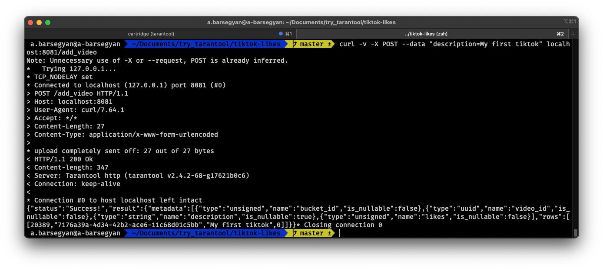
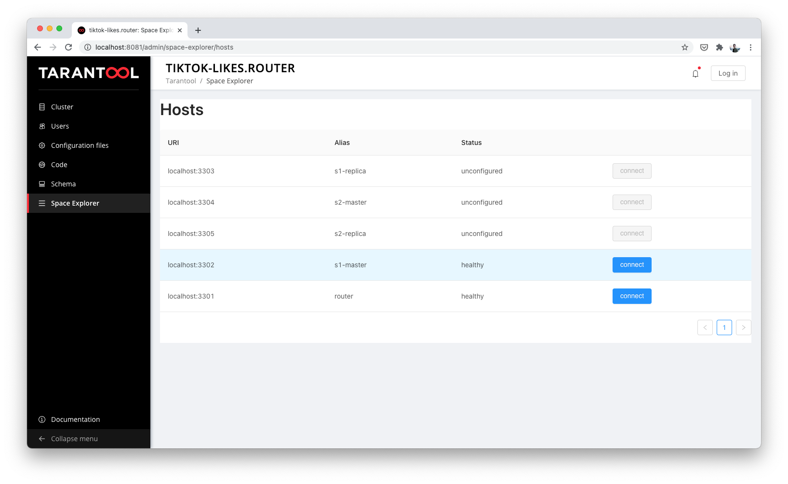
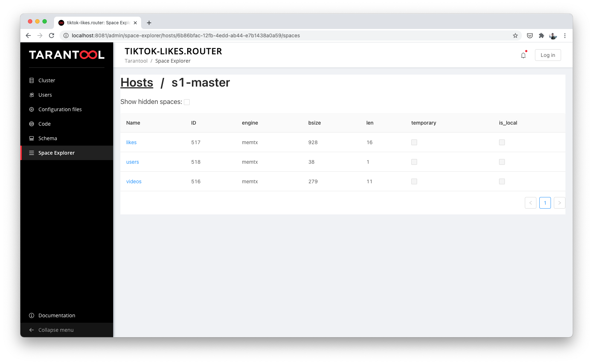
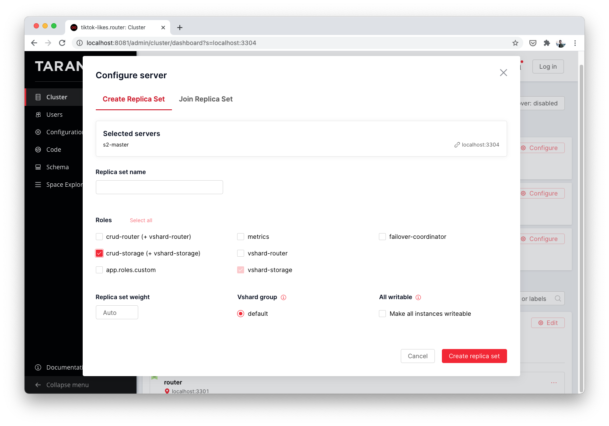

## Введение

Сегодня мы решим высоконагруженную задачку для сервиса Tiktok с помощью
Tarantool.

У такого сервиса обычно самая нагруженная часть --- это сохранение
лайков под видео. Нужно будет создать базовые таблицы, индексы для
поиска и в конце поднять HTTP API для мобильных клиентов.

Вам не потребуется писать дополнительный код. Все будет реализовано на
платформе Tarantool.

Если по ходу выполнения инструкции вы случайно сделали что-то не то,
есть волшебная кнопка, которая поможет вам сбросить все изменения.

Она называется **\"Reset Configuration\".** Она находится сверху, во вкладке "Cluster".


## Сконфигурируем кластер

**Все что нужно знать для старта:**

В кластере Tarantool есть две служебные роли: router, storage.

-   Storage --- это хранилище данных
-   Router --- это посредник между клиентами и Storage. Он принимает
    запросы от клиентов, ходит к нужным Storage за данными и возвращает
    их клиенту.

На вкладке \"Cluster\" мы видим, что в нашем распоряжении есть 5
несконфигурированных инстансов.


Создадим один Router и один Storage для
старта.

Сначала нажимаем кнопку "Configure" на инстансе "router" и настраиваем его
как на скриншоте ниже:


Далее настраиваем инстанс "s1-master":


Получится примерно вот так:


Включим шардирование в кластере с помощью кнопки "Bootstrap vshard".
Она находится справа сверху.


## Создаем схему данных [2 минуты]

Начнем со схемы данных: загляните во вкладку \"Code\". Она находится
слева.

Здесь мы сможем создать файл под названием `schema.yml`.
В нем можно описать схему данных для всего кластера,
отредактировать текущую схему, отвалидировать ее на корректность и
применить на всем кластере.

Создадим необходимые таблицы. В Tarantool они называются спейсами
(space).

Нам понадобится хранить:

-   пользователей
-   видео с их описаниями
-   лайки для каждого видео

**Чтобы загрузить схему в кластер создайте файл `schema.yml`. Скопируйте и вставьте
схему в этот файл. Нажмите на кнопку "Apply". После этого, в кластере будет описана схема данных.**

Вот как будет выглядеть наша схема данных:

> ```yaml
> spaces:
>   users:
>     engine: memtx
>     is_local: false
>     temporary: false
>     sharding_key:
>     - "user_id"
>     format:
>     - {name: bucket_id, type: unsigned, is_nullable: false}
>     - {name: user_id, type: uuid, is_nullable: false}
>     - {name: fullname, type: string,  is_nullable: false}
>     indexes:
>     - name: user_id
>       unique: true
>       parts: [{path: user_id, type: uuid, is_nullable: false}]
>       type: HASH
>     - name: bucket_id
>       unique: false
>       parts: [{path: bucket_id, type: unsigned, is_nullable: false}]
>       type: TREE
>
>   videos:
>     engine: memtx
>     is_local: false
>     temporary: false
>     sharding_key:
>     - "video_id"
>     format:
>     - {name: bucket_id, type: unsigned, is_nullable: false}
>     - {name: video_id, type: uuid, is_nullable: false}
>     - {name: description, type: string, is_nullable: true}
>     indexes:
>     - name: video_id
>       unique: true
>       parts: [{path: video_id, type: uuid, is_nullable: false}]
>       type: HASH
>     - name: bucket_id
>       unique: false
>       parts: [{path: bucket_id, type: unsigned, is_nullable: false}]
>       type: TREE
>
>   likes:
>     engine: memtx
>     is_local: false
>     temporary: false
>     sharding_key:
>     - "video_id"
>     format:
>     - {name: bucket_id, type: unsigned, is_nullable: false}
>     - {name: like_id, type: uuid, is_nullable: false }
>     - {name: user_id,  type: uuid, is_nullable: false}
>     - {name: video_id, type: uuid, is_nullable: false}
>     - {name: timestamp, type: string,   is_nullable: true}
>     indexes:
>     - name: like_id
>       unique: true
>       parts: [{path: like_id, type: uuid, is_nullable: false}]
>       type: HASH
>     - name: bucket_id
>       unique: false
>       parts: [{path: bucket_id, type: unsigned, is_nullable: false}]
>       type: TREE
> ```

Тут все просто. Рассмотрим, важные моменты.

В Tarantool есть два встроенных движка хранения: memtx и vinyl. Первый
хранит все данные в оперативной памяти, при этом асинхронно записывая на
диск, чтобы ничего не потерялось.

Второй движок Vinyl --- это классический движок для хранения данных на
жестком диске. Он оптимизирован для большого количества операций записи
данных.

Для сервиса Tiktok актуально большое кол-во одновременных чтений и
записей: пользователи смотрят видео, ставят им лайки и комментируют их.
Поэтому используем memtx.

Мы указали в конфигурации три спейса (таблиц) в memtx и для каждого из
спейсов указали необходимые индексы.

Их два для каждого спейса:

-   первый --- это первичный ключ. Необходим для того, чтобы
    читать/писать данные
-   второй --- это индекс для поля `bucket_id`. Это поле служебное и
    используется при шардировании.

**Важно:** название `bucket_id` зарезервированное. Если вы выберите
другое название, то шардирование для этого спейса работать не будет.
Если в проекте шардирование не используется, то его можно убрать.

Чтобы понять, по какому полю шардировать данные, Tarantool использует
`sharding_key`. `sharding_key` указывает на поле в спейсе, по которому
будут шардироваться записи. Tarantool возьмет хеш от этого поля при
вставке, вычислит номер бакета и подберет для записи нужный Storage.

Да, бакеты могут повторяться, а каждый Storage хранит определенный
диапозон бакетов.

Еще пара мелочей для любопытных:

-   Поле `parts` в описании индекса может содержать несколько полей для
    того, чтобы построить составной индекс. В данной задаче он не
    требуется.
-   Tarantool не поддерживает Foreign key или \"внешний ключ\", поэтому
    в спейсе `likes` нужно при вставке вручную проверять, что такой
    `video_id` и `user_id` существуют.


## Записываем данные [5 минут]

Записать данные в кластер Tarantool будем с помощью модуля CRUD. Этот
модуль сам определяет с какого шарда читать и на какой шард записывать и
делает это за вас.

Важно: все операции по кластеру необходимо производить только на роутере
и с помощью модуля CRUD.

Подключим модуль CRUD в коде и напишем три процедуры:

-   создание пользователя
-   добавление видео
-   лайк видео

**Процедуры нужно описать в специальном файле. Для этого перейдите во вкладку "Code". Создайте
новую дирректорию под названием "extensions". И в этой дирректории создайте файл "api.lua".**

Вставьте код описанный ниже в этой файл и нажмите на кнопку "Apply".


```lua
local cartridge = require('cartridge')
local crud = require('crud')
local uuid = require('uuid')
local json = require('json')

function add_user(request)
    local fullname = request:post_param("fullname")
    local result, err = crud.insert_object('users', { user_id = uuid.new(), fullname = fullname })
    if err ~= nil then
        return { body = json.encode({status = "Error!", error = err}), status = 500 }
    end

    return { body = json.encode({status = "Success!", result = result}), status = 200 }
end

function add_video(request)
    local description = request:post_param("description")
    local result, err = crud.insert_object('videos', { video_id = uuid.new(), description = description })
    if err ~= nil then
        return { body = json.encode({status = "Error!", error = err}), status = 500 }
    end

    return { body = json.encode({status = "Success!", result = result}), status = 200 }
end

function like_video(request)
    local video_id = request:post_param("video_id")
    local user_id = request:post_param("user_id")

    local result, err = crud.insert_object('likes', { like_id = uuid.new(),
                                                video_id = uuid.fromstr(video_id),
                                                user_id = uuid.fromstr(user_id)})
    if err ~= nil then
        return { body = json.encode({status = "Error!", error = err}), status = 500 }
    end

    return { body = json.encode({status = "Success!", result = result}), status = 200 }
end

return {
    add_user = add_user,
    add_video = add_video,
    like_video = like_video,
}
```

## Поднимем HTTP API [2 минуты]

Клиенты будут ходить в кластер Tarantool по протоколу HTTP. В кластере
уже есть свой встроенный HTTP сервер.

**Чтобы сконфигурировать HTTP пути необходимо написать конфигурационный файл. Для этого перейдите во вкладку "Code". Создайте
файл "config.yml" в дирректории "extensions". Вы ее создавали на прошлом шаге.**

Вставьте пример конфигурации описанный ниже в этой файл и нажмите на кнопку "Apply".


```yaml
---
 functions:

   customer_add:
     module: extensions.api
     handler: add_user
     events:
     - http: {path: "/add_user", method: POST}

   account_add:
     module: extensions.api
     handler: add_video
     events:
     - http: {path: "/add_video", method: POST}

   transfer_money:
     module: extensions.api
     handler: like_video
     events:
     - http: {path: "/like_video", method: POST}
...
```

Готово! Сделаем тестовые запросы из консоли:

```bash
curl -X POST --data "fullname=Taran Tool" <ip:port>/add_user
```

Создали пользователя и получили его UUID. Запомним его.

```bash
curl -X POST --data "description=My first tiktok" <ip:port>/add_video
```

Представим что пользователь добавил свое первое видео с описанием. Также
получили UUID видео ролика. Его тоже запомним.

Для того чтобы \"лайкнуть\" видео, нужно указать UUID пользователя и
UUID видео. Подставим его из первых двух шагов за место троточия ниже.

```bash
curl -X POST --data "video_id=...&user_id=..." <ip:port>/like_video
```

Получится, примерно вот так:



В нашем примере \"лайкать\" видео можно сколько угодно раз. Хоть в
реальной жизни это и лишено смысла, но это поможет нам понять как
работает шардирование. А точнее параметр `sharding_key`.

Для спейса `likes` мы указали `sharding_key` —
`video_id`. Такой же `sharding_key` мы указали и
для спейса `videos`. Это означает, что лайки будут храниться
на том же Storage, на котором хранится и видео. Это обеспечивает
локальность по данным при хранении и позволяет за один сетевой поход в
Storage получить необходимую информацию.

Подробнее описано в следующем шаге.

## Смотрим на данные [1 минута]

Переходим на вкладку \"Space-Explorer\" и видим все узлы в кластере.
Т.к. у нас пока поднят всего один Storage и один Router, то данные
хранятся только на одном узле.

Переходим в узел `s1-master` : нажимаем \"Connect\" и выбираем нужный
нам спейс.

Смотрим, что все на месте и переходим дальше.




Обратите внимание: инструмент `space-explorer` доступен только в Enterprise версии продукта.
В open-source версии данные можно посмотреть через консоль.

Читайте [подробнее в документации](https://www.tarantool.io/ru/doc/latest/reference/reference_lua/box_space/select/).

## Масштабируем кластер [1 минута]

Создадим второй шард. Нажимаем на вкладку \"Cluster\", выбираем
`s2-master` и нажимаем \"Configure\". Выбираем роли так как на картинке:





Шелкаем на нужные роли и создаем шард (репликасет).

Узлы `s1-replica`, `s2-replica` добавляем как реплики к первому и
второму шарду соответственно.

## Смотрим, как работает шардирование [1 минута]

Теперь у нас есть два шарда --- два логических узла, которые будут
разделять между собой данные. Роутер сам решает, какие данные на какой
шард положить. По умолчанию, он просто использует хеш-функцию от поля
`sharding_key` , которое мы указали в DDL.

Чтобы задействовать новый шард, надо выставить его вес в единицу.
Заходим снова на вкладку \"Cluster\" и переходим в настройки `s2-master`
и выставляем Replica set weight в 1 и применяем.

Кое-что уже произошло. Зайдем в space-explorer и перейдем на узел
`s2-master`. Оказывается, часть данных с первого шарда переехала сюда
автоматически! Масштабирование происходит автоматически.

Теперь попробуем добавить еще новых данные в кластер через HTTP API.
Можем проверить и убедиться, что новые данные также равномерно
распределяются на два шарда.

## Один шард надо на время выключить [1 минута]

Выставляем в настройках `s1-master` Replica set weight в 0 и применяем.
Подождем пару секнуд и заходим в space-explorer и смотрим на данные в
`s2-master`: все данные автоматически мигрировали на оставшийся шард.

Теперь мы можем смело отключать первый шард, если вам понадобилось
провести служебные работы.

## Установка

**Для пользователей Linux/macOS:**

-   установите Tarantool [со страницы
    Download](https://tarantool.io/ru/download)
-   установите через ваш пакетный менеджер утилиту `cartridge-cli`

``` {.bash}
sudo yum install cartridge-cli
```

``` {.bash}
brew install cartridge-cli
```

Подробнее про установку утилиты `cartridge-cli` читайте
[тут](https://github.com/tarantool/cartridge-cli).

-   склонируйте репозиторий
    [https://github.com/tarantool/try-tarantool](https://github.com/tarantool/try-tarantool)

В данном репозитории все готово к работе - в папке со склонированным
примером выполните:

``` {.bash}
cartridge build
cartridge start
```

Готово! По адресу <http://localhost:8081> вы увидите UI Tarantool
Cartridge.

**Запуск в Docker:**

``` {.bash}
docker run -p 3301:3301 -p 8081:8081 tarantool/getting-started
```

Готово! По адресу <http://localhost:8081> вы увидите UI Tarantool
Cartridge.

**Для пользователей Windows:**

-   Используйте Docker контейнер с centOS 8 или
-   используйте механизм WSL и следуйте инструкции по установке под
    Linux.

## Читайте также

-   [Изучите документацию Tarantool
    Cartridge](https://www.tarantool.io/ru/doc/latest/book/cartridge/) и
    напишите свое распределенное приложение
-   Изучите репозиторий
    [tarantool/examples](https://github.com/tarantool/examples) на
    Github с готовыми примерами на Tarantool Cartridge: кэш, репликатор
    MySQL и другие.
-   README модуля [DDL](https://github.com/tarantool/ddl) для создания
    своей схемы данных
-   README модуля [CRUD](https://github.com/tarantool/crud) чтобы узнать
    больше про API и реализовать собственные запросы по кластеру
